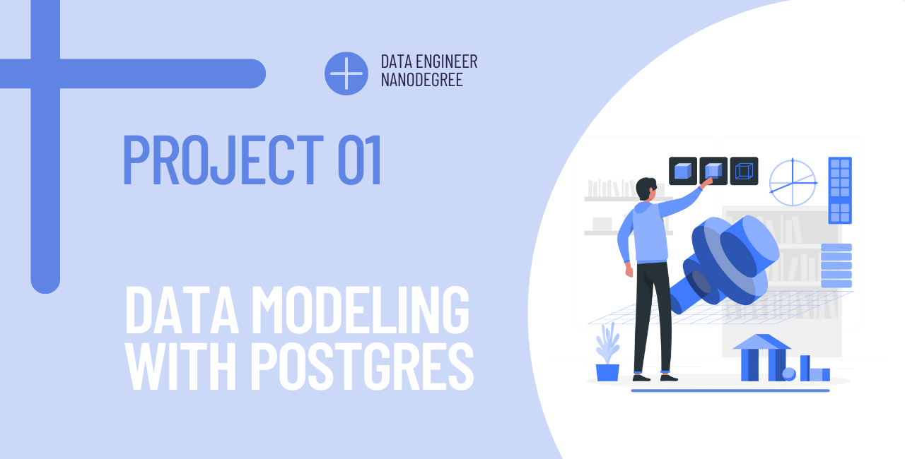
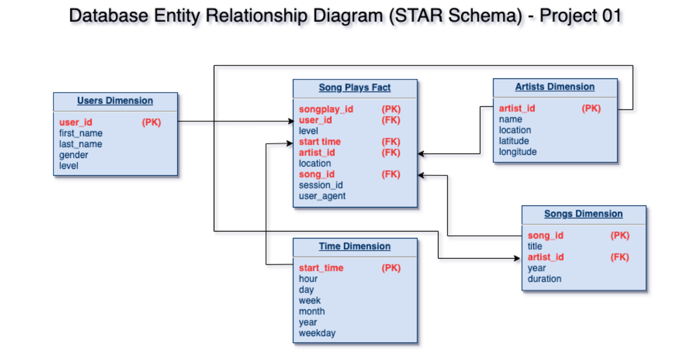

<!-- Add banner here -->


# Project Title

<!-- Add buttons here -->
[](https://www.python.org/downloads/release/python-365/) 


[](https://www.linkedin.com/in/djanmagno)

<!-- PROJECT LOGO -->
<br />

<p align="center">
 <a href="https://github.com/djanmagno/Udacity-Data-Engineer-Nanodegree">
 </a>
 <h2 align="center"><b>Data Modeling ETL with PostgreSQL</b></h2>
 <p align="center">
  Udacity Data Engineer Nanodegree Course Project 1
  <br />
  <a href=https://github.com/djanmagno/Udacity-Data-Engineer-Nanodegree><strong>Explore the repository»</strong></a>
  <br />
  <br />
 </p>


</p>

> Postgresql, Data Engineering, ETL, Star Schema Database, Data Modeling


<!-- ABOUT THE PROJECT -->

## About The Project

<!-- Describing the project in brief -->

A startup called Sparkify wants to analyze the data they've been collecting on songs and user activity on their new music streaming application. The analytics team is particularly interested in understanding what songs users are listening to. Currently, they don't have an easy way to query their data, which resides in a directory of JSON logs on user activity on the application, as well as a directory with JSON meta-data on the songs in their application.

They'd like a data engineer to create a Postgres database with tables designed to optimize queries on song play analysis. The role of this project is to create a database schema and ETL pipeline for this analysis. 

### Project Description

In this project, we will model the data with Postgres and build an ETL pipeline using Python. The fact and dimension tables for a star database schema for a particular analytic focus is defined, and an ETL pipeline that transfers data from files in two local directories into these tables in Postgres using Python and SQL was developed.

### Built With:

* Python
* PostgreSQL
* Jupyter Notebooks

> You will not be able to run **test.ipynb**, **etl.ipynb**, or **etl.py** until you have run **create_tables.py** at least once to create the *sparkifydb* database, which these other files connect to. Always, close the connection to the database on exit. 

### Dataset
#### Song Dataset
Songs dataset is a subset of [Million Song Dataset](http://millionsongdataset.com/).  Each file in the dataset is in JSON format and contains meta-data about a song and the artist of that song. 

Sample Record :
```
{"num_songs": 1, "artist_id": "ARJIE2Y1187B994AB7", "artist_latitude": null, "artist_longitude": null, "artist_location": "", "artist_name": "Line Renaud", "song_id": "SOUPIRU12A6D4FA1E1", "title": "Der Kleine Dompfaff", "duration": 152.92036, "year": 0}
```

#### Log Dataset
Logs dataset is generated by [Event Simulator](https://github.com/Interana/eventsim).  These log files in JSON format simulate activity logs from a music streaming application based on specified configurations.

Sample Record :
```
{"artist": null, "auth": "Logged In", "firstName": "Walter", "gender": "M", "itemInSession": 0, "lastName": "Frye", "length": null, "level": "free", "location": "San Francisco-Oakland-Hayward, CA", "method": "GET","page": "Home", "registration": 1540919166796.0, "sessionId": 38, "song": null, "status": 200, "ts": 1541105830796, "userAgent": "\"Mozilla\/5.0 (Macintosh; Intel Mac OS X 10_9_4) AppleWebKit\/537.36 (KHTML, like Gecko) Chrome\/36.0.1985.143 Safari\/537.36\"", "userId": "39"}
```


## Database Schema Design

### Database Entity Relationship Diagram 

The scheme used in this project was the Star Schema where we have Song Plays as a fact table that contains all the metrics (facts) associated with each event (user actions) and four other dimension tables that contain data related to the user, artist, songs and time data such as day, hour, etc.

This approach is mostly used for relational data modeling, it allows us to have a search in a database using the minimum number of "Joins" in our queries which consequently generates quick reads.

In this project, the amount of data used is not large enough for us to use a big data or NoSQL database solution.

The Entity Relationship Diagram (ERD) of the data model is represented by the image
below:



## Project structure

Files in this repository:

|  File / Folder   |                         Description                          |
| :--------------: | :----------------------------------------------------------: |
|       data       | Folder at the root of the project, where all song and log data JSONS reside |
|      images      |  Folder at the root of the project, where images are stored  |
|  sql_queries.py  |      Contains the SQL queries for data modeling and ETL      |
| create_tables.py |         Drops and creates tables. (Reset the tables)         |
|    test.ipynb    |                Exploring the database tables                 |
|    etl.ipynb     | Processes a file from song_data and log_data and loads the data into tables |
|      etl.py      | Processes all files from song_data and log_data and loads them into  tables |
|      README      |                         Readme file                          |


<!-- GETTING STARTED -->

## Getting Started

Clone the repository into a local machine using

```sh
git clone https://github.com/djanmagno/Udacity-Data-Engineer-Nanodegree
```

### Prerequisites

These are the prerequisites to run the program.

* python 3.9+
* PostgreSQL
* psycopg2 python library
* pandas library

### How to run

Follow the steps to extract and load the data into the data model.

1. Navigate to `Project-1-Data-Modeling-with-Postgres` folder

2. Run `create_tables.py` to create/reset the tables by

   ```python
   python create_tables.py
   ```

3. Run ETL process and load data into database by 

   ```python
   python etl.py
   ```

4. Check whether the data has been loaded into database by executing queries in `test.ipynb`


<!-- LICENSE -->

## License

Distributed under the MIT License. See `LICENSE` for more information.


<!-- CONTACT -->

## Contact

Djan Magno - djan.magno@gmail.com

Project Link - [https://github.com/djanmagno/Udacity-Data-Engineer-Nanodegree/tree/master/Project-1-Data-Modeling-with-Postgres](https://github.com/djanmagno/Udacity-Data-Engineer-Nanodegree/tree/master/Project-1-Data-Modeling-with-Postgres)