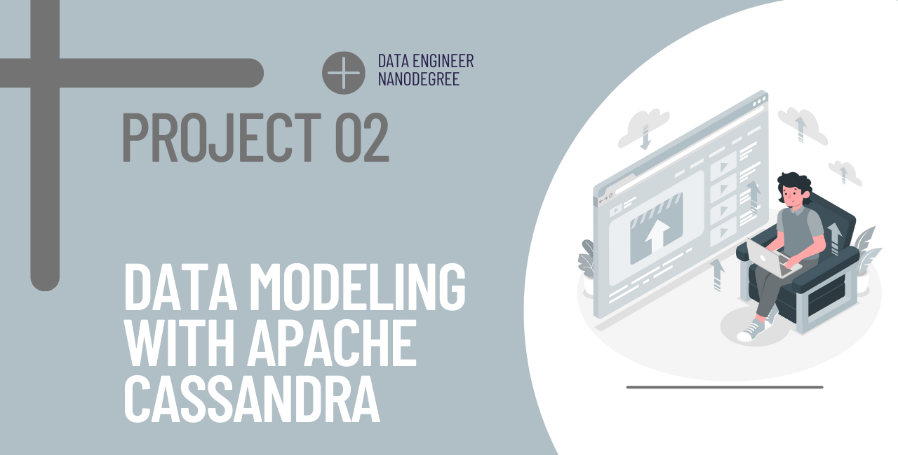
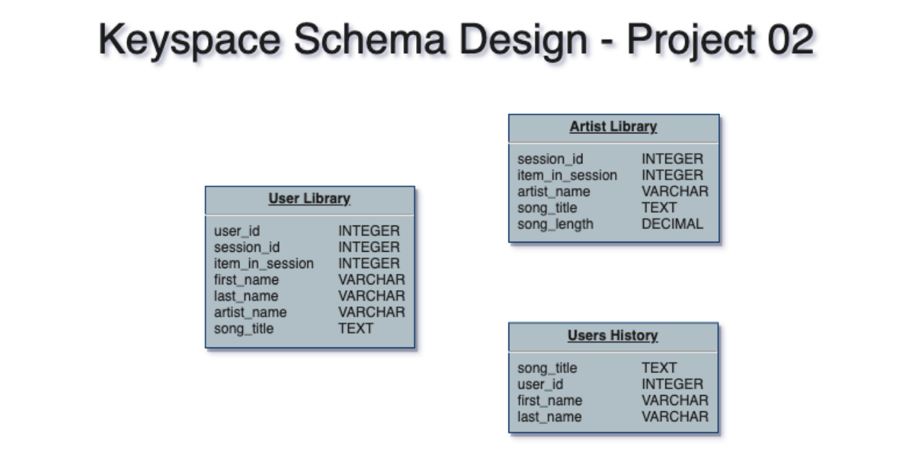
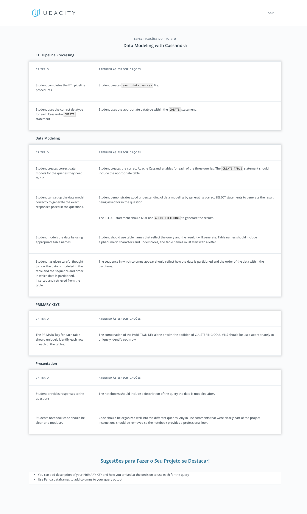

<!-- Add banner here -->


# Project Title

<!-- Add buttons here -->
[](https://www.python.org/downloads/release/python-365/) 


[](https://www.linkedin.com/in/djanmagno)

<!-- PROJECT LOGO -->
<br />

<p align="center">
 <a href="https://github.com/djanmagno/Udacity-Data-Engineer-Nanodegree">
 </a>
 <h2 align="center"><b>Data Modeling ETL with Apache Cassandra</b></h2>
 <p align="center">
  Udacity Data Engineer Nanodegree Course Project 2
  <br />
  <a href=https://github.com/djanmagno/Udacity-Data-Engineer-Nanodegree><strong>Explore the repository»</strong></a>
  <br />
  <br />
 </p>


</p>

> Data Engineering, Data Modeling, Apache Cassandra, NoSQL Databases, ETL 


<!-- ABOUT THE PROJECT -->

## About The Project

<!-- Describing the project in brief -->

A startup called Sparkify wants to analyze the data they've been collecting on songs and user activity on their new music streaming app. The analysis team is particularly interested in understanding what songs users are listening to. Currently, there is no easy way to query the data to generate the results, since the data reside in a directory of CSV files on user activity on the app.

They'd like a data engineer to create an Apache Cassandra database which can create queries on song play data to answer the questions, and wish to bring you on the project. Your role is to create a database for this analysis. You'll be able to test your database by running queries given to you by the analytics team from Sparkify to create the results. 

### Project Description

In this project, we will model the data with Apache Cassandra and build an ETL pipeline using Python. The ETL pipeline transfers data from a set of CSV files within a directory to create a streamlined CSV file to model and insert data into Apache Cassandra tables. We will create separate denormalized tables for answering specific queries, properly using partition keys and clustering columns.

### Built With:

* Python
* Apache Cassandra
* Jupyter Notebooks 

### Dataset
#### Event Data
It is a directory of CSV files partitioned by date containing the information of user activity across a period of time. Each file in the dataset contains the information regarding the song played, user information and other attributes. This directory needs to be processed through an ETL pipeline that will save all data in the CSV files in only one CSV file called **event_datafile_new**. Here are examples of filepaths to two files in the dataset:

```
event_data/2018-11-08-events.csv
event_data/2018-11-09-events.csv
```

#### event_datafile_new
This file contains all informations presented in all CSV files on the directory Event Data. Below you can find the list of available data columns presented on the new file created.

```
artist, auth, firstName, gender, itemInSession, lastName, length, level, location, method, page, registration, sessionId, song, status, ts, userId
```


## Keyspace Schema Design

### Data Model Entity Relationship Diagram 

The keyspace design is depicted in the illustration below. Each table will be modeled to respond to a specific query on Apache Cassandra. This modeling process will allow us to query a Keyspace schema with a large amount of data. Due to the volume of data, relational databases are ineffective in this situation, that is the reason why Apache Cassadra was choosen for this project.

The Keyspace Schema Design of the data model is represented by the image
below:



## Project Structure

Repository:

|              Files / Folders             |                                                Description                                                  |
| :--------------------------------------: | :---------------------------------------------------------------------------------------------------------: |
|                 event_data               | Directory of CSV files partitioned by date with informations of user activity.                              |
|           event_datafile_new.csv         | CSV file which contains all informations from the files of event_data folder.                               |
|                   images                 | Folder with images used on the project.                                                                     |
| Project-2-DM-with-Apache-Cassandra.ipynb | Jupiter Notebook WITH the ETL pipeline FOR data extraction, modeling and loading into the keyspace tables.  |
|                 README.md                | File with all instructions and descriptions of the project.                                                 |


<!-- GETTING STARTED -->

## Getting Started

Clone the repository into a local machine using

```sh
git clone https://github.com/djanmagno/Udacity-Data-Engineer-Nanodegree
```

### Prerequisites

The prerequisites to run the program are:

* python 3.9+
* Apache Cassandra
* cassandra Python Library

### How to run

Follow the steps below to extract and load the data into the sparkify database on Postgres.

1. Navigate to `Project-2-Data-Modeling-with-Apache-Cassandra` folder.

2. Open `Project-2-DM-with-Apache-Cassandra.ipynb` Jupiter Notebook.

3. Run Part 1 ETL pipeline for pre-processing files to create the event_datafile_new.csv file.
   
4. Run Part 2 to initiate the ETL process and load data into the tables created in the sparkifi_ks keyspace.

5. Check whether the data was loaded into database by executing the three SELECT queries indicated. 

### Project Requirements

The requeriments for this project can be found on the image below.



<!-- LICENSE -->

## License

Distributed under the MIT License. See `LICENSE` for more information.


<!-- CONTACT -->

## Contact

Djan Magno - djan.magno@gmail.com

Project Link - [https://github.com/djanmagno/Udacity-Data-Engineer-Nanodegree/tree/master/Project-2-Data-Modeling-with-Apache-Cassandra](https://github.com/djanmagno/Udacity-Data-Engineer-Nanodegree/tree/master/Project-2-Data-Modeling-with-Apache-Cassandra)