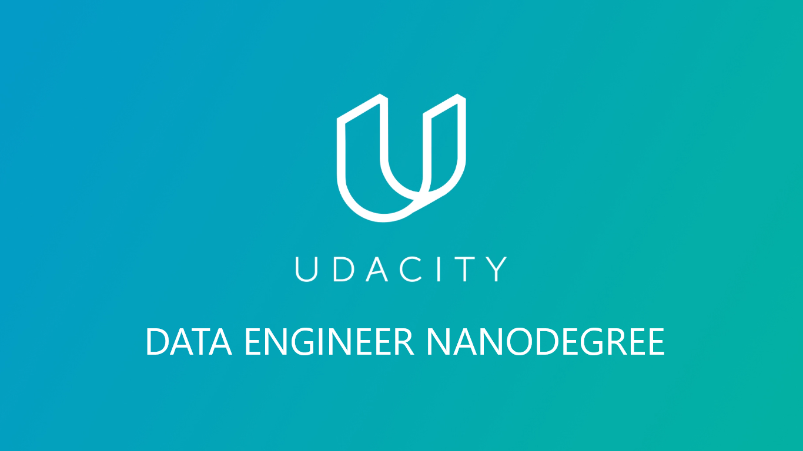

<!-- Add banner here -->

## Project Title
 

 </a>
 <h1 align="center">Udacity Data Engineering Nanodegree</h1>
 

  Udacity Nanodegree
   
  <a href=https://github.com/djanmagno/Udacity-Data-Engineer-Nanodegree><strong>Explore the repository»</strong></a>
   
   
 

<!-- Add buttons here -->
 

> Postgres, Cassandra, AWS, RedShift, S3, EMR, Spark, Airflow, ETL, ELT, Data Modelling, Database Schema, Data Warehousing, Data Lakes, Data Engineering, Udacity

## About The Nanodegree

Data engineers are responsible for making data accessible to all the people who use it across an organization. That could mean creating a data warehouse for the analytics team, building a data pipeline for a front-end application, or summarizing massive datasets to be more user-friendly.

## Certificate

<!--  -->

TO BE DONE!

## **Program Details**

During this program,  we will complete four courses and five projects. Throughout the projects,  we will play the part of a data engineer at a music streaming company. We will work with the same type of data in each project, but with increasing data volume, velocity, and complexity. Here’s a course-by- course breakdown.

#### **Course 1 – Data Modeling**

In this course,  we will learn to create relational and NoSQL data models to fit the diverse needs of data consumers. In the project,  we will build SQL (Postgres) and NoSQL (Apache Cassandra) data models using user activity data for a music streaming app.

Associated notebooks for this course can be found [here](https://github.com/djanmagno/Udacity-Data-Engineer-Nanodegree/tree/master/Notebook-Exercises).

Project 1 can be found [here](https://github.com/djanmagno/Udacity-Data-Engineer-Nanodegree/tree/master/Project-1-Data-Modeling-with-Postgres). 

Project 2 can be found [here]([Not done yet](https://github.com/djanmagno/Udacity-Data-Engineer-Nanodegree/tree/master/Project-2-Data-Modeling-with-Apache-Cassandra).

<!-- #### **Course 2 – Cloud Data Warehouses**

In this course,  we will learn to create cloud-based data warehouses. In the project,  we will build an ELT pipeline that extracts data from Amazon S3, stages it in Amazon Redshift, and transforms it into a set of dimensional tables.

Associated notebooks for this course can be found [here](###). 

Project 3 can be found [here](###). 

#### **Course 3 – Data Lakes with Apache Spark**

In this course,  we will learn more about the big data ecosystem, how to work with massive datasets with Apache Spark, and how to store big data in a data lake. In the project,  we will build an ETL pipeline for a data lake using Apache Spark and S3.

Associated notebooks for this course can be found [here](###).

Project 4 can be found [here](###). 

#### **Course 4 – Data Pipelines with Apache Airflow**

In this course,  we will learn to schedule, automate, and monitor data pipelines using Apache Airflow. In the project, they’ll continue your work on the music streaming company’s data infrastructure by creating and automating a set of data pipelines. 

Associated notebooks for this course can be found [here](###).

Project 5 can be found [here](###). 

#### **Capstone Project**

Undecided project.

Capstone Project can be found [here](###). -->

 

<!-- LICENSE -->

## License

[(Back to top)](#table-of-contents)

Distributed under the MIT License. See `LICENSE` for more information.

[MIT License](https://opensource.org/licenses/MIT)

<!-- CONTACT -->

## Contact

Djan Magno - djan.magno@gmail.com

Project Link - [https://github.com/djanmagno/Udacity-Data-Engineer-Nanodegree](https://github.com/djanmagno/Udacity-Data-Engineer-Nanodegree)

## Footer
[(Back to top)](#table-of-contents)

<!-- Let's also add a footer because I love footers and also you **can** use this to convey important info.
Let's make it an image because by now you have realised that multimedia in images == cool(*please notice the subtle programming joke). -->

Leave a star in GitHub, give a clap in Medium and share this guide if you found this helpful.

<!-- Add the footer here -->

